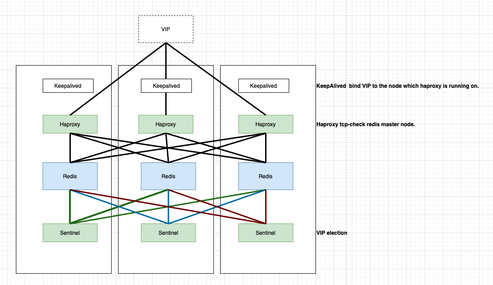

Redis Sentinel Cluster With docker, haproxy
--------------
## Design

## Cluster Nodes

+ 10.124.44.105 - master
+ 10.124.44.106 - replicator
+ 10.124.44.107 - replicator

## Keepalived Deployment

Setup keepalived service on all nodes.

keepalived binding vip to the node which has haproxy service is alive.

- Create configuration file

```bash
mkdir /etc/keepalived/ && cd /etc/keepalived/
touch keepalived.conf
```
```bash
global_defs {
   script_user root
   enable_script_security

}

vrrp_script chk_haproxy {
    script "/bin/bash -c 'if [[ $(netstat -nlp | grep 9443) ]]; then exit 0; else exit 1; fi'"  # haproxy check
    interval 2
    weight 11
}

vrrp_instance VI_1 {
  interface ens32

  state MASTER # node role by default, this is master node
  virtual_router_id 51 # same id means same virtual group
  priority 100 # weight
  nopreempt # role can change to be master

  unicast_peer {

  }

  virtual_ipaddress {
    10.124.44.125  # vip
  }

  authentication {
    auth_type PASS
    auth_pass password
  }

  track_script {
      chk_haproxy
  }

  # notify "/container/service/keepalived/assets/notify.sh"
}
```

- run keepalived container

```bash
docker run --cap-add=NET_ADMIN --cap-add=NET_BROADCAST --cap-add=NET_RAW --net=host --volume /etc/keepalived/keepalived.conf:/usr/local/etc/keepalived/keepalived.conf -d osixia/keepalived:2.0.20 --copy-service
```
## Haproxy Setup

#### Haproxy Docker

``` bash
docker run -d --name=diamond-haproxy --net=host  -v /etc/haproxy:/usr/local/etc/haproxy/:ro haproxy
```

#### Haproxy Settings

``` bash
frontend  redis-postprocess-tcp
    mode tcp
    bind *:6380

    default_backend             redis-postprocess-tcp

backend redis-postprocess-tcp
    mode tcp
    option tcplog
    option tcp-check
    #uncomment these lines if you have basic auth
    tcp-check send AUTH\ 123456\r\n
    tcp-check expect string +OK
    tcp-check send PING\r\n
    tcp-check expect string +PONG
    tcp-check send info\ replication\r\n
    tcp-check expect string role:master
    tcp-check send QUIT\r\n
    tcp-check expect string +OK
    server redis-105 10.124.44.105:6379 maxconn 1024 check inter 1s
    server redis-106 10.124.44.106:6379 maxconn 1024 check inter 1s
    server redis-107 10.124.44.107:6379 maxconn 1024 check inter 1s
```

## Redis Cluster Setup

#### Create Redis.conf On Master Node

``` bash
cat <<EOF > /usr/local/etc/redis/redis.conf
bind 0.0.0.0
requirepass "123456"
replicaof 10.124.44.105 6379
masterauth "123456"
EOF
```

#### Create Redis.conf On Replicator Node

``` bash
cat <<EOF > /usr/local/etc/redis/redis.conf
bind 0.0.0.0
requirepass "123456"
replicaof 10.124.44.105 6379
masterauth "123456"
EOF
```

#### Create Sentinel.conf On All Nodes

``` bash
cat <<EOF > /usr/local/etc/redis/sentinel.conf
port 26379
daemonize yes
# sentinel deny-scripts-reconfig yes
sentinel monitor mymaster 10.124.44.105 6379 2
sentinel down-after-milliseconds mymaster 26379
sentinel auth-pass mymaster 123456
```

#### Run Redis Server Docker Container On All Nodes

``` bash
docker run  -tid --name redis --network host -p 6379:6379 -v /usr/local/etc/redis:/usr/local/etc/redis redis redis-server /usr/local/etc/redis/redis.conf
```

#### Run Redis Sentinel Docker Container On All Nodes

``` bash
docker run  --rm -tid --name sentinel --network host -p 26379:26379 -v /usr/local/etc/redis:/usr/local/etc/redis redis sh -c "redis-sentinel /usr/local/etc/redis/sentinel.conf --sentinel & tail -f /dev/null" 
```

